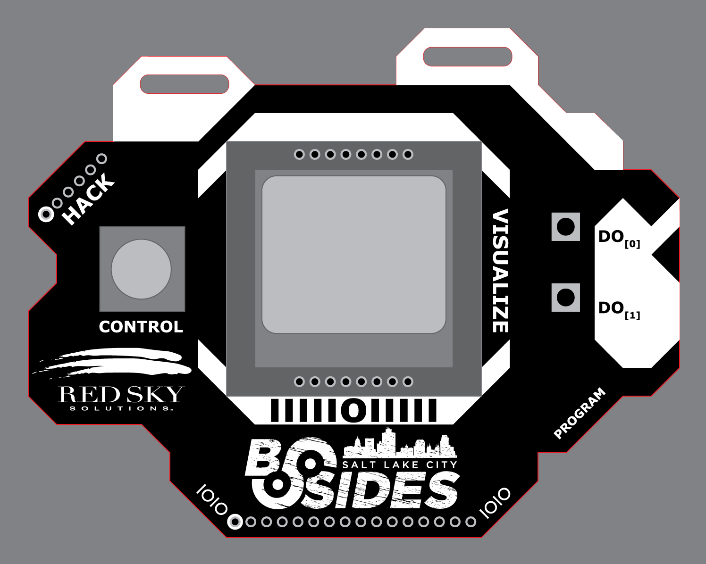

# BSidesSLC 2015 Electronic Badge
theTransistor, DC801, and 801 Labs brings you another fun conference badge.

**NOTE: The displays used in these badges are no longer being produced. They come from left over Nokia5110 units produced in China MANY years ago. Some of them have trouble working correctly. If you have this problem, we suggest gently pressing on the bottom of the LCDs metal frame. This sometimes helps reseat the internal display connector.**

##QuickSpecs
- Arduino bootloaded.
  - Any Atmega32u4 8mhz 3.3v bootloader will do.
  - We used the [Spark Fun Pro-Micro Bootloader and Arduino Hardware Files](https://www.sparkfun.com/products/12587)
- Atmel 32u4 mCU running at 8mhz on 3.3v
- Nokia 5110 LCD Display
  - 84px wide x 48px tall
  - Adjustable LED Backlight
  - Adjustable Contrast (via software)
- Controls
  - A (really) small 5 way Joypad
  - 2 Action Buttons
- Extra IO
  - Extra GPIO has been conveniently been broken-out on the bottom-edge of the board.
- Power
  - Selectable USB / 2x AAA Battery Power
  
  
##Reprogramming
Reprogramming can be done either over USB via the Arduino IDE, or over the serial "HACK" ISP breakout. To use the Arduino programming over USB, you will need to copy Atmega32u4 hardware files into the "hardware" folder in your Arduino installation. See the SparkFun link above for more information.

##Credits:

**Electronics Work & Processing**
- Compukidmike
- Devino

**QA, Assembly, & Loading**
- l3mur (aka aarobc)
- Nemus
- Compukidmike
- Yukaia

**Original Design, Code, & Mgmt**
- D3c4f

**Special Thanks**
- Nemus
- T4rkus & BSidesSLC

##Questions and Comments
Questions and comments can be directed twards the following forms of communication:
- \#dc801 on freenode
- d3c4f [at] thetransistor [dot] com

